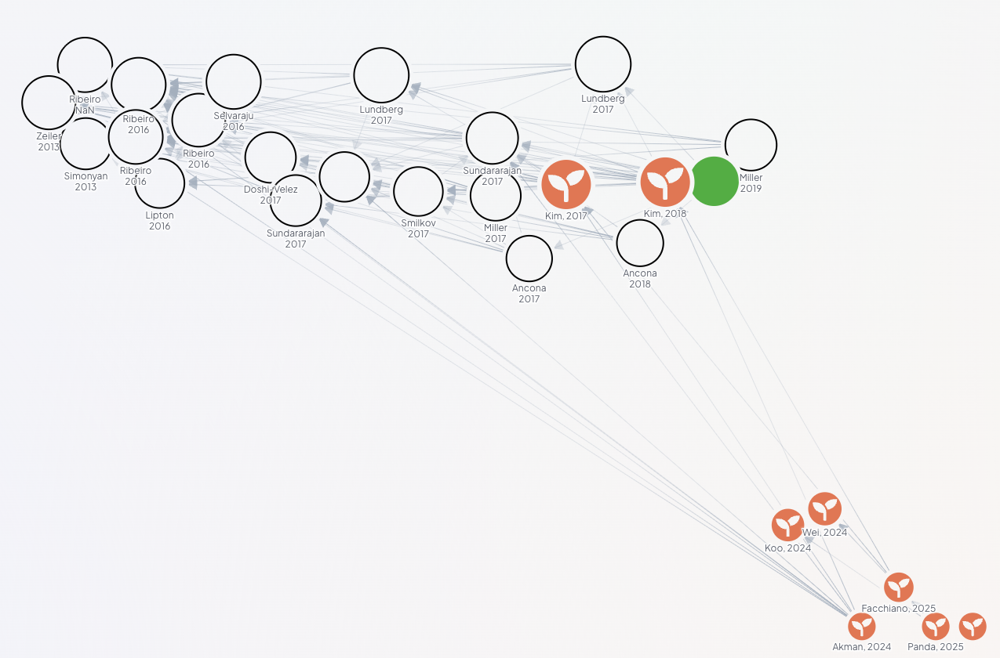

# SIWY 2025Z

## Team
- Mikołaj Szawerda
- Patryk Filip Gryz
- Anna Schäfer

## Design Proposal

### Description
The goal of the project is to extend the previous research with the quality evaluation of trained model, visualization of the model output and research, usage and comparison of alternative methods to our previous method.

### Schedule

| Date            | Task                                                                                                         |
|-----------------|--------------------------------------------------------------------------------------------------------------|
| 3 Nov -  9 Nov  | Familiarization with materials and domain                                                                    |
| 10 Nov - 16 Nov | Better familiarization with materials and domain                                                             |
| 17 Nov - 23 Nov | Evaluating DiffMean / Impl better sae evaluation                                                             |
| 24 Nov - 30 Nov | Evaluating activation based methods / Impl better sae evaluation                                             |
| 1 Dec -  7 Dec  | Evaluating activation based methods / SAE on audio activations                                               |
| 8 Dec - 14 Dec  | Evaluating intervention techniques  /  SAE on audio activations / first visualization of results(gradio app) |
| 15 Dec - 21 Dec | Evaluating intervention technique  /  Comparison of evaluated methods with SAE / visualization of methods    |
| 22 Dec - 28 Dec | Winter break / *Reserve*                                                                                     |
| 29 Dec -  4 Jan | Winter break / *Reserve*                                                                                     |
| 5 Jan - 11 Jan  | Final touches -> selection of best methods and its usage in app                                              |
| 12 Jan - 18 Jan | Polishing                                                                                                    |
| 19 Jan - 23 Jan | *Reserve*                                                                                                    |

\*Reserve - reserve week to catch up on delayed tasks

### Planned Experiments

#### Evaluation of meaningfulness of musicSAE outputs
- check if output of the model makes sense: maximally activating examples; methods that requires further research
- check if meaningfulness of the trained model is better than simpler methods
  - Compare SAE feature representation against linear probe performance. Assess whether SAE-extracted features (sparse codes) retain task-relevant information compared to the original, dense activations (e.g., layer activations) by comparing the performance of simple linear probes trained on both sets of representations for classification tasks (e.g., instrument recognition, genre classification, or music theory concepts from SynTheory data)
- check how data influence the meaningfulness of the model outputs
- train sae only on audio activations(without providing prompt)

#### Evaluating/improving alternative methods for explaining/controlling musicgen-like models 

- comparing methods that use activations of some part of the model(transformer layers/attention heads/cross-attention activations) -> ex. DiffMean, activation patching
- finding working method for inference time intervention: ex. Recursive Feature Machines, Self-Monitored Inference-Time INtervention, DiffMean, EDITGEN

### Planned Functionalities
- visualization of active features during output generation -> by best working method
- implementation of method(s) to evaluate the quality or meaningfulness of xai model outputs - accessing whether the explanations make sens
    - baseline approach using sparse autoencoders (SAE).
- method for inference time intervention
  - baseline in fixxed concepts

### Planned Technology Stack
**General**
- python
- uv
- ruff
- just
- git
- hydra

**NN-specific**
- nnsight
- wandb
- huggingface (datasets, transformers)
- torch

**Vizualization**
- gradio

### Bibliography

| Title                                                                                                                | Link                                                                                                                                                                                                                                                                                                                                     | Description                                                                                                            | Misc                                                                                                                                      |
|----------------------------------------------------------------------------------------------------------------------|------------------------------------------------------------------------------------------------------------------------------------------------------------------------------------------------------------------------------------------------------------------------------------------------------------------------------------------|------------------------------------------------------------------------------------------------------------------------|-------------------------------------------------------------------------------------------------------------------------------------------|
| SAeUron: Interpretable Concept Unlearning in Diffusion Models with Sparse Autoencoders                               | https://arxiv.org/pdf/2501.18052                                                                                                                                                                                                                                                                                                         | Usage of SAE to modify output of generative model;                                                                     |                                                                                                                                           |
| Are Sparse Autoencoders Useful? A Case Study in Sparse Probing                                                       | https://arxiv.org/pdf/2502.16681                                                                                                                                                                                                                                                                                                         | Limitation of SAE's, efficiency of SAE depends on strongly on data and target model                                    |                                                                                                                                           |
| ACTIVATION PATCHING FOR INTERPRETABLE STEERING IN MUSIC GENERATION                                                   | [arXiv](https://arxiv.org/pdf/2504.04479)                                                                                                                                                                                                                                                                                                | Techniques for DiffMean method                                                                                         |                                                                                                                                           |
| AttentionViz: A Global View of Transformer Attention                                                                 | [arXiv](https://arxiv.org/pdf/2305.03210)                                                                                                                                                                                                                                                                                                | Visualization of transformer internal mechanisms                                                                       |                                                                                                                                           |
| Audio Explanation Synthesis with Generative Foundation Models                                                        | [arXiv](https://arxiv.org/pdf/2410.07530)                                                                                                                                                                                                                                                                                                | Generation of listenable explanations on Encodec                                                                       | Code: [github.com/glam-imperial/AudioXgen](https://github.com/glam-imperial/AudioXgen)                                                    |
| BEYOND GENRE: DIAGNOSING BIAS IN MUSIC EMBEDDINGS USING CONCEPT ACTIVATION VECTORS                                   | [arXiv](https://arxiv.org/pdf/2509.24482)                                                                                                                                                                                                                                                                                                | Extraction of concept vectors                                                                                          | Code: [github.com/WhoCares96/CAV-MIR](https://github.com/WhoCares96/CAV-MIR)                                                              |
| Controlling Large Language Models Through Concept Activation Vectors                                                 | [arXiv](https://arxiv.org/pdf/2501.05764)                                                                                                                                                                                                                                                                                                | Other CAV description                                                                                                  |                                                                                                                                           |
| EDITGEN: HARNESSING CROSS ATTENTION CONTROL FOR INSTRUCTION-BASED AUTO-REGRESSIVE AUDIO EDITING                      | [arXiv](https://arxiv.org/pdf/2507.11096)                                                                                                                                                                                                                                                                                                | Prompt-to-Prompt audio editing techniques                                                                              | Code: [github.com/billsioros/EditGen](https://github.com/billsioros/EditGen)                                                              |
| DO MUSIC GENERATION MODELS ENCODE MUSIC THEORY?                                                                      | [arXiv](https://arxiv.org/pdf/2410.00872)                                                                                                                                                                                                                                                                                                | SynTheory dataset introduction; probing classifier analysis example                                                    | Code: [github.com/brown-palm/syntheory](https://github.com/brown-palm/syntheory)                                                          |
| EXPLORING THE INNER MECHANISMS OF LARGE GENERATIVE MUSIC MODELS                                                      | [PDF](https://www.researchgate.net/profile/Marcel-Velez-2/publication/390627829_EXPLORING_THE_INNER_MECHANISMS_OF_LARGE_GENERATIVE_MUSIC_MODELS/links/67f68b0f95231d5ba5bd5b7e/EXPLORING-THE-INNER-MECHANISMS-OF-LARGE-GENERATIVE-MUSIC-MODELS.pdf?_tp=eyJjb250ZXh0Ijp7ImZpcnN0UGFnZSI6InB1YmxpY2F0aW9uIiwicGFnZSI6InB1YmxpY2F0aW9uIn19) | Usage of decoderlens on musicgen; activation replacement                                                               | Code: [github.com/Marcel-Velez/musicgen-mech-interp](https://github.com/Marcel-Velez/musicgen-mech-interp)                                |
| Explainable AI for Time Series via Virtual Inspection Layers                                                         | [arXiv](https://arxiv.org/pdf/2303.06365)                                                                                                                                                                                                                                                                                                | visualization ideas for time series                                                                                    | Repo (collection): [github.com/JHoelli/Awesome-Time-Series-Explainability](https://github.com/JHoelli/Awesome-Time-Series-Explainability) |
| Exploring the Internal Mechanisms of Music LLMs: A Study of Root and Quality via Probing and Intervention Techniques | [OpenReview](https://openreview.net/pdf?id=Kr6nkNa4TQ)                                                                                                                                                                                                                                                                                   | Example of convoluted features; method to create linearly separable features                                           |                                                                                                                                           |
| Fine-Grained control over Music Generation with Activation Steering                                                  | [arXiv](https://arxiv.org/pdf/2506.10225v1)                                                                                                                                                                                                                                                                                              | High level features steering; usage of many methods (linear probes, regression, diffmean, inference-time intervention) | Code: [github.com/Jayden3316/AI-Rahman](https://github.com/Jayden3316/AI-Rahman)                                                          |
| SMITIN: Self-Monitored Inference-Time INtervention for Generative Music Transformers                                 | [arXiv](https://arxiv.org/pdf/2404.02252v2)                                                                                                                                                                                                                                                                                              | Usage of attention heads activations for ITI                                                                           | Code: [github.com/merlresearch/smitin](https://github.com/merlresearch/smitin)                                                            |
| STEERING AUTOREGRESSIVE MUSIC GENERATION WITH RECURSIVE FEATURE MACHINES                                             | [arXiv](https://arxiv.org/pdf/2510.19127)                                                                                                                                                                                                                                                                                                | Introduction of new method for creating new controls for musicgen                                                      | Code: [github.com/astradzhao/music-rfm](https://github.com/astradzhao/music-rfm)                                                          |
| UNDERSTANDING AND CONTROLLING GENERATIVE MUSIC TRANSFORMERS BY PROBING INDIVIDUAL ATTENTION HEADS                    | [PDF](https://www.merl.com/publications/docs/TR2024-032.pdf)                                                                                                                                                                                                                                                                             | Analysis of activations of attention heads in musicgen                                                                 |                                                                                                                                           |
| Towards Principled Evaluations of Sparse Autoencoders for Interpretability and Control                               | https://arxiv.org/abs/2405.08366                                                                                                                                                                                                                                                                                                         |                                                                                                                        |                                                                                                                                           |
| Rethinking Evaluation of Sparse Autoencoders through the Representation of Polysemous Words                          | https://openreview.net/forum?id=HpUs2EXjOl                                                                                                                                                                                                                                                                                               |                                                                                                                        |                                                                                                                                           |
| Measuring Sparse Autoencoder Feature Sensitivity                                                                     | https://arxiv.org/abs/2509.23717v1                                                                                                                                                                                                                                                                                                       |                                                                                                                        |                                                                                                                                           |
| SPARSE AUTOENCODERS MAKE AUDIO FOUNDATION MODELS MORE EXPLAINABLE                                                    | https://arxiv.org/pdf/2509.24793                                                                                                                                                                                                                                                                                                         |                                                                                                                        |                                                                                                                                           |
| DISCOVERING AND STEERING INTERPRETABLE CONCEPTS IN LARGE GENERATIVE MUSIC MODELS                                     | https://arxiv.org/pdf/2505.18186                                                                                                                                                                                                                                                                                                         |                                                                                                                        |                                                                                                                                           |
| SAE-V: Interpreting Multimodal Models for Enhanced Alignment                                                         | https://arxiv.org/pdf/2502.17514                                                                                                                                                                                                                                                                                                         |                                                                                                                        |                                                                                                                                           |

(We will be trying quite new papers)

