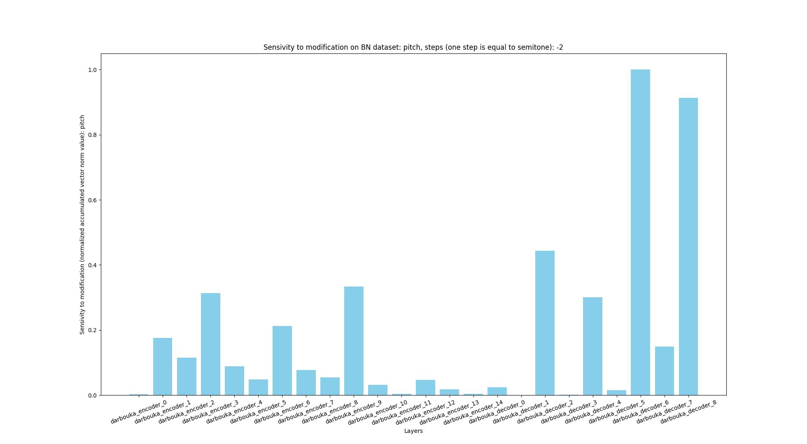
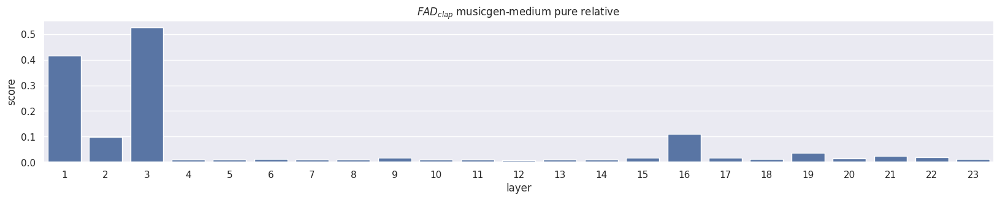
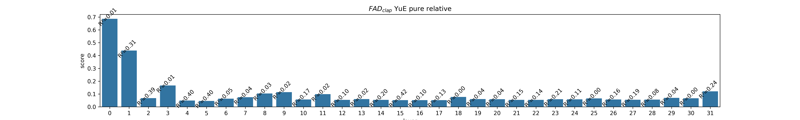
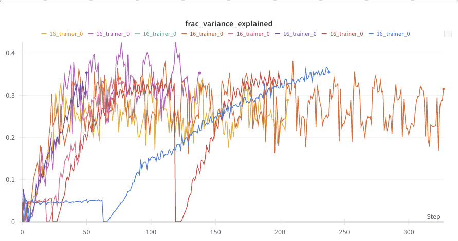
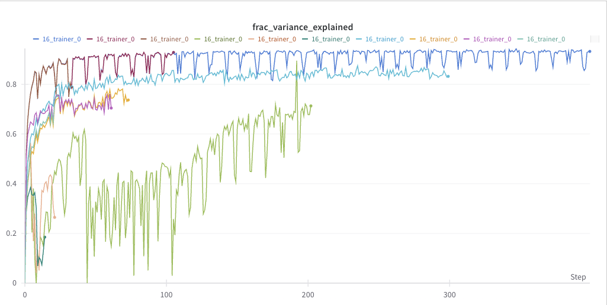
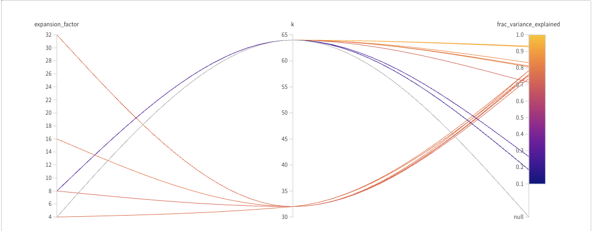
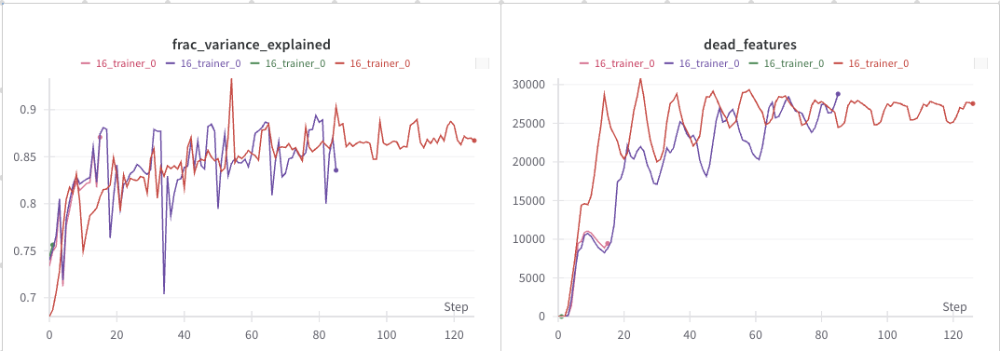
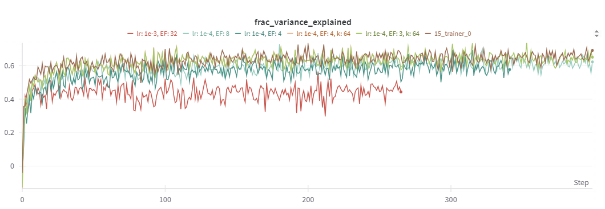

<p align="center">
  <h1 align="center">WIMU 2025L</h1>
  <h2 align="center">MusicSAE - Final Documentation</h2>
</p>

## Team
- Mikołaj Szawerda
- Mateusz Kiełbus
- Patryk Filip Gryz

## Goal

The goal of this project was to discover meaningful representations withing generative music models that enabled controlled modification of the model's output by manipualting high-level features. We focused on identyfing such representations and the presence of interpretable concepts in models like MusicGen, RAVE and YuE using XAI methods - primarly Sparse AutoEncoders (SAEs). Given the limited prior exploration of SAE for explaining synthetic music models, we also incorporated additional approaches such as activation patching [https://arxiv.org/pdf/2309.16042](https://arxiv.org/pdf/2309.16042).

## Used Technology
- python
- ruff
- uv
- just
- git
- pytorch
- accelerate :huggingface:
- datasets :huggingface:
- transformers :huggingface:

## Conducted experiments

### Rave Ablation

```
For the RAVE model, due to its architecture, a naive ablation study was not feasible, so we applied activation patching. We analyzed the effect of pitch shifts and found that decoder layers 5 and 7 had the strongest impact.
```


### MusicGen Ablation
```
An ablation study on MusicGen shows that layers 13 and 16 significantly impact output quality. Layer 16 likely captures high-level features, while early layers focus on input decoding.
```



### YuE Ablation
```
In YuE, a similar pattern to MusicGen is observed, with layer 15 capturing a wide range of features. This suggests it encodes high-level representations critical to generation quality.
```


### Collecting activations

As proofed in the experiments there was requirment to use diverse audio/prompt datasets. We have choosen four popular datasets:
- fma
- mtg-jamendo
- music-bench
- song-describer

Due to YuE’s architecture, which processes vocal and instrumental tokens separately, we split the audio into vocal and instrumental stems. This also enabled the use of instrumental tracks in MusicGen instead of full audio, improving SAE variance by 0.1.

To support other datasets in the future we introduced *plugin architecture* which allows to easly write custom transformations and loading for given dataset and use it with already present ones.

Additionaly we have used *accelerate* library to easily support mutli-gpu execution.

We used the nnsight library to trace the models without generating new tokens, which significantly sped up activation collection. This approach also allowed us to access, save, and intervene on activations directly, additionally enabling efficient ablation studies.

We used dictionary_learning as the main implementation of SAE, as it provides all the necessary functionalities required for our project, including feature extraction.

YuE operates on interleaved vocal and instrumental tokens; since the other two models generate only instrumental music, we focused our analysis on the instrumental part. To achieve this, we extracted activations at positions corresponding to instrumental tokens.


### Training SAE

We have trained several SAE models for musicgen-small and medium.

**MusicGen-Medium**

During most of our trainings we were traing to increase results of musicgen-medium model as even after adding more diverse dataset variance was never exceeding certain value.


After lots of experiments it turned out that our activations normalization phase was to short which resulted in poor training results. After increasing normalization steps + using only instrumentals + finding best *k vs expansion factor* + enough and diverse data we managed to achieve > 0.9 explained variance.





**MusicGen-Small**



**Yue**


During SAE training for the YuE model, we also observed that a lower expansion factor (EF) increases the SAE variance. In contrast to MusicGen, enabling activation normalization in slightly increases the SAE variance.



### SAE interpretation

After succesfull SAE training we performed automatic feature labeling process:
- for each track activations we aggregated mean activation with respect to time
- we calculated corpus-level feature activation rate(when mean activation > 0)
- we filtered features which activation rate didn't meet 0.01 < act_rate < 0.25
- for each feature we have grouped top 10 tracks with respect to their activation mean

After manual listening of some features we have noticed that tracks despite being from complelty different recordings had simillar features.

We have used multimodal llm's to automaticaly find common features for those subsets. We have used Qwen and gemine-2.0-flash. After labeling we have calculated mean clap score between text description and audio embedings and for the best ones we have manualy listened to them

### SAE interventions

We have tried performing intervention on small and medium models with algorithms:
- before every nth token activate given feature in sae latent space and decode it
- given prompt and sae features which fires within that prompt multiply by: negative;0;positive number and observe
- copy activation pattern from track with feature A to generated track with prompt having feature B

Unfortunetly quality of the outputs wasn't as crisp as we expected and potentialy we require to increase diveristy and quality of the datasets.

## Limitations and discovered issues

During the project, we encountered several challenges and limitations:
- Audio datasets often do not provide separate vocal and instrumental stems, requiring audio separation (e.g., using Demucs) which adds a time-consuming preprocessing step before activations collection.
- SAEs require a large number of activations for training, which must be generated in advance due to the slow generation process. They also require a large number of activations, necessitating the use of multiple datasets.
- The size of collected activations, even for small datasets, is substantial and can reach hundreds of gigabytes.
- Training SAE takes several hours even with a relatively small amount of activationss (e.g., 500 GB) and demands a high-speed storage device for efficient data access.
- Searching for features in SAEs demands a large amount of RAM.